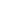
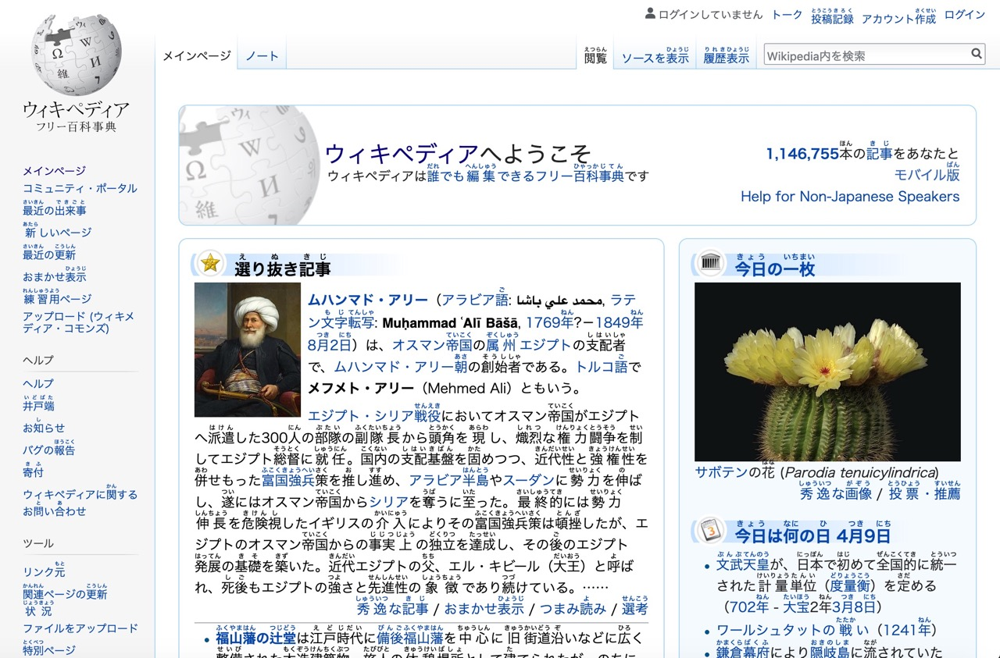

<h1 align="center">

 
Furigana
</h1>

A web extension, Auto insert furigana (phonetic characters) on Japanese kanji.

## Feature

* Auto inject Japanese web pages.
* Support dynamic pages.
* Context menu shortcut.

## Screenshot

